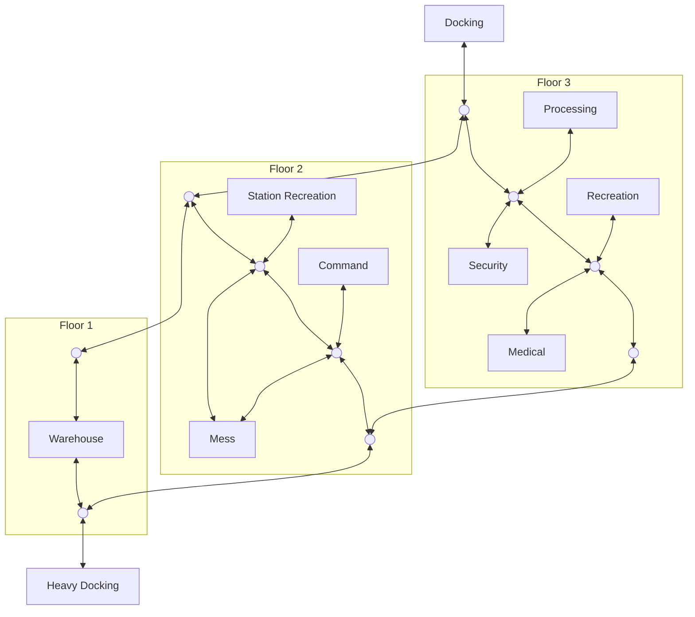

[Station-Layouts](Game/Station-Layouts)
{: .label .label-blue }

## Warehouse

```mermaid
graph TD
  Docking <--> F3ENTRY <--> F2ENTRY <--> F1ENTRY 
  subgraph F1[Floor 1]
  F1ENTRY(( )) <--> Warehouse <--> F1ENTRY2(( ))
  end
  subgraph F2[Floor 2]
    F2ENTRY(( )) <--> hallwayF2(( ))
    Station_Recreation[Station Recreation] <--> hallwayF2 <--> Mess
    hallwayF2(( )) <--> farHallwayF2(( ))
    Command <--> farHallwayF2 <--> Mess
    farHallwayF2 <--> F2ENTRY2(( ))
  end
  subgraph F3[Floor 3]
    F3ENTRY(( )) <--> hallwayF3(( ))
    Processing <--> hallwayF3 <--> Security
    hallwayF3(( )) <--> farHallwayF3(( ))
    Recreation <--> farHallwayF3 <--> Medical
    farHallwayF3 <--> F3ENTRY2(( ))
  end
  
  F3ENTRY2 <--> F2ENTRY2 <--> F1ENTRY2 <--> Heavy_Docking[Heavy Docking]
```